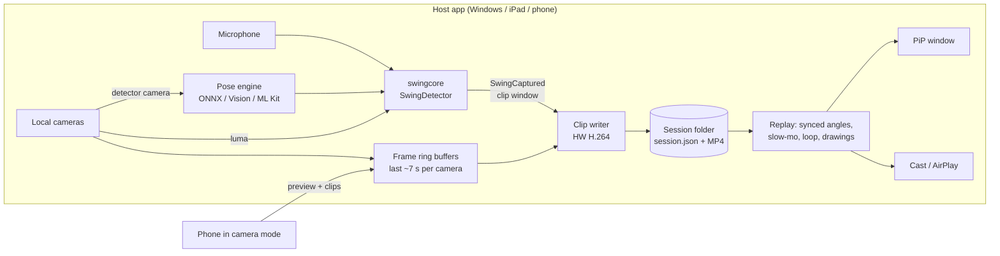

# SwingLoop architecture

SwingLoop records a golf swing, then replays it on a loop until the next
swing. Practice swings and waggles never count. It runs natively on
Windows, iOS and Android, and phones can act as extra camera angles for any
host.



## Repository layout

| Path | What |
|---|---|
| `core/` | **swingcore**: portable C++17 library with a C ABI. Swing detection, audio impact detection, motion energy, session storage, annotations, layout math. No dependencies. |
| `windows/SwingLoop.Windows/` | WinUI 3 / .NET 8 app. |
| `ios/` *(phase 3)* | SwiftUI + AVFoundation app, links swingcore as an XCFramework. |
| `android/` *(phase 3)* | Kotlin + Jetpack Compose + CameraX app, links swingcore through a JNI shim. |
| `docs/CAMERA_PROTOCOL.md` | How phones stream to a host. |
| `tools/` | Model export and helper scripts. |

## Why a shared C++ core

The hard, subtle logic has to behave identically on every device:

* **Deciding what a swing is.** If Windows and iPhone disagreed about a
  waggle, the product would feel broken.
* **The session format.** A session recorded on a phone must open on Windows
  and the other way round.
* **Drawing geometry.** Hit-testing and angle measurement must be identical,
  so edits made on one device look the same on another.
* **Grid, rotation and crop math**, so multi-camera views look the same everywhere.

Everything platform-specific (camera, encoder, UI, casting, sharing) stays
native. The core does no I/O besides the session folder, and it has no threads.

### C ABI

`core/include/swingcore/swingcore_c.h` is the only boundary:

* **Windows:** `swingcore.dll` + P/Invoke (`Interop/SwingCore.cs`).
* **iOS:** static library in an XCFramework, imported through a module map.
  Swift calls the C functions directly.
* **Android:** `libswingcore.so` built by the NDK through CMake, with a small
  JNI shim (`android/app/src/main/cpp/jni.cpp`) that exposes the same
  functions to Kotlin.

Structured data (sessions, shots, shapes) crosses the ABI as JSON strings.
Timing-critical calls (pose, audio, luma) use plain arrays.

## Swing detection

`SwingDetector` combines three signals:

1. **Pose.** 17 COCO keypoints per analysed frame, at about 30 Hz.
   * Hand height is measured in torso lengths above the hips, so it doesn't
     depend on camera distance, zoom or resolution: 0 is the hips, 1 is the
     shoulders.
   * The sequence is address (hands low and still for 350 ms) → takeaway →
     top (hands above the shoulders) → downswing → impact (hands back near
     their address height) → finish.
   * **Waggles** move the hands but never reach the top, so they are
     dropped. So are half swings.
   * **Motion blur** often hides the hands during the downswing. The detector
     tolerates that gap and estimates impact when the hands reappear in the
     finish.
2. **Impact sound.** High-passed energy with an adaptive noise floor, plus a
   fast-attack test. This picks out the club-on-ball crack and ignores talk,
   music and simulator fans. A 350 ms refractory period skips the ball
   hitting the screen right after.
   * **A full swing with no impact inside ±300 ms counts as a practice
     swing.** It isn't saved, unless the user turns that on.
   * When the sound is heard, it also gives the exact impact time. Pose
     alone is only accurate to about one frame at 30 Hz.
3. **Motion energy.** The fraction of changed pixels on a 160×90 grid. This
   confirms impacts that pose missed (for example, the golfer is half out of
   frame), so a dropped club or the next bay's shot doesn't trigger a clip.

Each signal can be turned off:

* **Pose only** (no microphone): every full swing counts.
* **Audio + motion only** (no pose model): impacts confirmed by motion count.
* **Manual:** the "Save swing" button or the **M** key keeps the last few
  seconds.

The detector is fed with timestamps on **one shared monotonic clock**, so
it's deterministic: `core/tests` replay synthetic golfers through it
(full swings, waggles, half swings, blurred downswings, back-to-back shots).

### Clip window

The detector fires only after impact. Every camera therefore keeps a ring
buffer of recent frames: pre-roll (2 s) + post-roll (1.5 s) + about 3.5 s of
headroom for slow backswings. When a swing is captured:

* The window starts at `min(impact − preRoll, takeaway − 0.3 s)` and ends at
  `max(impact + postRoll, finish + 0.3 s)`.
* The host waits until every camera has frames up to the end of the window.
* It then cuts the same clock window from **every** camera's ring. That's
  what keeps multi-angle clips aligned.

## Sessions on disk

```
<Videos>/SwingLoop/2026-09-25_153012/
    session.json            schema v1, rewritten atomically on every change
    shots/0001/cam1-face-on.mp4
    shots/0001/cam1-face-on.jpg
    shots/0001/cam2-down-the-line.mp4
```

* A session starts when the app opens. It ends when the app closes or when
  the user presses **End session**, which starts a new one immediately.
* A crash leaves a session without `endedAt`. It is still valid and browsable.
* Each shot stores:
  * its timing (address, takeaway, top, impact and finish, plus the tempo ratio)
  * star, comment, club and tags
  * detection confidence and source
  * one clip per camera, with `impactOffsetUs`, so replays line up at impact
  * vector annotations
* `extra` is reserved for launch-monitor data.

## Annotations

Shapes are vectors with points normalized to the video frame. Each shape
belongs to the camera angle it was drawn on. There are two scopes:

* **This shot.** Stored in `shot.annotations`.
* **Every shot** (swing plane, head circle, alignment lines). Stored in
  `session.persistentAnnotations`. These also appear on the live view, so
  they work as setup guides.

Shapes stay editable: select, drag handles, recolor, restyle, delete and
undo. They're only rendered into pixels on export, and only if the user asks
for "with drawings".

## Windows app

| Concern | Implementation |
|---|---|
| Capture | `MediaCapture` + `MediaFrameReader` (NV12, CPU). Picks the highest fps at ≤ the chosen resolution. Frames go into a ref-counted `FrameRing`. |
| Live preview | `MediaSource.CreateFromMediaFrameSource`, rendered on the GPU in `MediaPlayerElement`. |
| Pose | MoveNet through ONNX Runtime + DirectML. Letterboxed and rotated to the camera's mounting, so portrait-mounted cameras work. |
| Audio | `AudioGraph` frame output node, mono float, lowest latency. |
| Encoding | `MediaStreamSource` → `MediaTranscoder`, hardware H.264. |
| Replay | One `MediaTimelineController` drives every player: all angles, compare mode and the PiP window. Speed, frame-step, loop and impact alignment all live in one place. |
| Drawing | `AnnotationCanvas` (XAML shapes) inside each `VideoSurface`, sharing its rotation, zoom and pan transform. |
| Export | Win2D renders the overlay; `MediaComposition` burns it in. Stills use `GetThumbnailAsync`. |
| PiP | Second window: always on top, borderless, resizable, optional aspect lock, shares the timeline. |
| Casting | `CastingDevice` (Miracast/DLNA) for the replay; Win+K system mirroring for the whole app or the PiP window. AirPlay isn't available on Windows; iOS provides it. |
| Layout | `VideoTilesPanel` uses the core grid algorithm. The optional uniform crop (16:9, 4:3, 1:1, 9:16) makes mixed portrait and landscape phones tile cleanly. |

### Threads

* Each camera delivers frames on its own capture thread.
* The detector camera's frames go through a **1-slot channel** to the
  analysis thread. Stale frames are dropped, never queued, so detection
  latency stays bounded.
* Audio arrives on the AudioGraph thread.
* The detector is internally locked.
* Events are drained on the UI thread every 30 ms.

## Phone apps (phase 3 plan)

| | iOS | Android |
|---|---|---|
| UI | SwiftUI | Jetpack Compose |
| Capture | AVCaptureSession, 120/240 fps formats, `AVCaptureDevice.videoZoomFactor` (optical, then digital) | CameraX + Camera2 interop for high fps, `CameraControl.setZoomRatio` |
| Pose | Vision `VNDetectHumanBodyPoseRequest`, mapped to COCO-17 | ML Kit Pose Detection (base), mapped to COCO-17 |
| Encoder | VideoToolbox (HEVC/H.264) | MediaCodec |
| Rolling buffer | Encoded GOP ring (1 s GOPs) instead of raw frames, to save memory | Same |
| PiP | `AVPictureInPictureController` with a sample-buffer display layer | `enterPictureInPictureMode` + aspect ratio params |
| Cast | AirPlay (`AVRoutePickerView`); screen mirroring through Control Center | Google Cast SDK (replay) + system Cast |
| Auto-rotation | Device orientation mapped to capture rotation; the core rotation crop keeps the aspect | Same with `OrientationEventListener` |
| Share / save | `UIActivityViewController`, Photos (`PHPhotoLibrary`) | Sharesheet, `MediaStore` |
| Camera mode | Streams to a host over `docs/CAMERA_PROTOCOL.md` | Same |
